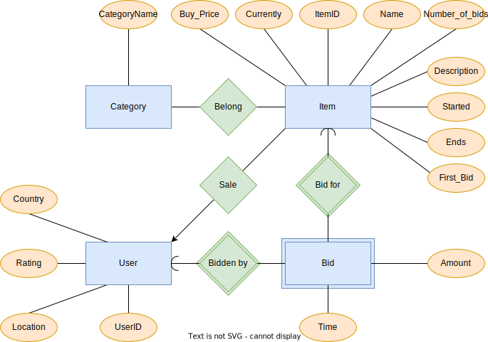

# CS 564 Homework 2 - ER Modeling & Schema Design

Binhao Chen, Yang Yang, Yishen Sun

## ER diagram



## Relational schema definitions

This is Category table. CategoryID is the primary key.

```sql
CREATE TABLE Category (
    CategoryName      VARCHAR(255)    PRIMARY KEY
);
```

This is Belong table, which stores the many-to-many relationship between items and categories. CategoryID and Item make the primary key.

```sql
CREATE TABLE Belong (
    CategoryName      VARCHAR(255),
    ItemID          INTEGER,
    PRIMARY KEY (CategoryName, ItemID),
    FOREIGN KEY (CategoryName) REFERENCES Category (CategoryName),
    FOREIGN KEY (ItemID) REFERENCES Item (ItemID),
);
```

This is User table. UserID is the primary key. Country and Location could be NULL.

```sql
CREATE TABLE User (
    UserID          VARCHAR(255)    PRIMARY KEY,
    Country         VARCHAR(255),
    Location        VARCHAR(255),
    Rating          INTEGER         NOT NULL
);
```

This is Item table. ItemID is the primary key.

```sql
CREATE TABLE Item (
    ItemID          INTEGER         PRIMARY KEY,
    Number_of_Bids  INTEGER         NOT NULL,
    First_Bid       DOUBLE          NOT NULL,
    Buy_Price       DOUBLE,
    Currently       DOUBLE          NOT NULL,
    Name            VARCHAR(255)    NOT NULL,
    Started         DATETIME        NOT NULL,
    Ends            DATETIME        NOT NULL,
    SellerID        VARCHAR(255),
    Description     VARCHAR(255)    NOT NULL,
    FOREIGN KEY (SellerID) REFERENCES User (UserID),
);
```

This is Bid table, which stores bidding events. One user could bid an item at a time. UserID and ItemID and Time make the primary key.

```sql
CREATE TABLE Bid (
    UserID      VARCHAR(255)        NOT NULL,
    ItemID      INTEGER             NOT NULL,
    Amount      VARCHAR(255)        NOT NULL,
    Time        DATETIME            NOT NULL,
    FOREIGN KEY (UserID) REFERENCES User (UserID),
    FOREIGN KEY (ItemID) REFERENCES Item (ItemID),
    PRIMARY KEY (UserID, ItemID, Time)
);
```
